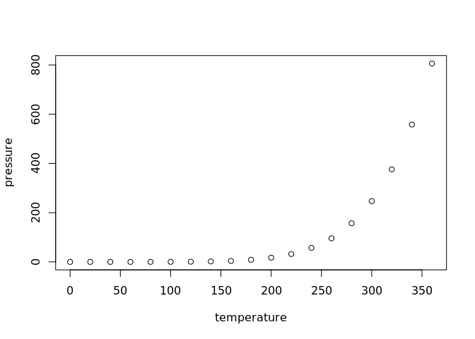

<!-- README.md is generated from README.Rmd. Please edit that file -->

# healr

<!-- badges: start -->
<!-- badges: end -->

The goal of healr is to provide tools for the study of homeologous
exchanges in neo-polyploids. It enables copy number inference at a
subgenome level using EAGLE-RC sorted bam-files. Then, inferred copy
numbers can be combined with GENESPACE output (synteny inference) to
obtain estimates of HE events and copy number ratio for homeologous
genes. Incidentally this will also reveal non-HE copy number changes.
Given data from samples directly related to each other it is possible to
derive HE rate per generation. If data from progenitor species is
available they can be used to identify copy number alterations commonly
found in non-polyploid relatives. This helps quantify which
rearrangements are attributable to polyploidization.

## Installation

You can install the development version of healr from
[GitHub](https://github.com/) with:

``` r
# install.packages("devtools")
devtools::install_github("kenji-yt/healr")
```

## Input

The input should be a single directory which follows a precise
structure. This is important as healr relies heavily on this assumed
directory structure. This input directory should be organised exactly as
follows:

-Input directory: \<Two directories: progenitor & polyploid\>

- progenitor: \<One directory per progenitor species & one genespace
  directory\>
  - prog1: \<mappability, gc content and bin range bed files\>
    \[Important: make sure the last word before “.bed” is as shown for
    all bed files\]
    - prog1_mappability.bed
    - prog1_gc.bed
    - prog1_bins.bed
    - annotation.gff
    - any_progenitor_sample(s).bam \[if available\]
  - prog2: <Same content as prog1>
  - genespace: <At least these two files> \[Important: make sure the
    last word before “.” is as shown\]
    - syntenicBlock_coordinates.csv
    - prog1_vs_prog2.synHits.txt
- polyploid: <One directory per allopolyploid sample>
  - sample_1: <One directory per progenitor subgenome>
    - prog1: <bam file with reads assigned to this progenitor subgenome>
      - sample_1_prog1.bam
    - prog2:
      - sample_1_prog2.bam
  - sample_2: <Same as sample_1>
  - etc… (any number of samples)

The mappability, gc and bins bed files should all end with those words
followed by “.bed”. You can generate these files using bedtools and
genmap as shown in this
[tutorial](https://thefoodiesavenue.com/bread-pakora-dipain-frire/). The
read sorted bam files can be obtained using
[EAGLE-RC](https://github.com/tony-kuo/eagle). The files within the
genespace directory can be obtained using
[GENESPACE](https://github.com/jtlovell/GENESPACE). You can also use the
HEAL workflow designed to perform all the required steps in an
automated, reproducible and easy to use manner.

## Example

This is a basic example which shows you how to solve a common problem:

``` r
library(healr)
## basic example code
```

What is special about using `README.Rmd` instead of just `README.md`?
You can include R chunks like so:

``` r
summary(cars)
#>      speed           dist       
#>  Min.   : 4.0   Min.   :  2.00  
#>  1st Qu.:12.0   1st Qu.: 26.00  
#>  Median :15.0   Median : 36.00  
#>  Mean   :15.4   Mean   : 42.98  
#>  3rd Qu.:19.0   3rd Qu.: 56.00  
#>  Max.   :25.0   Max.   :120.00
```

You’ll still need to render `README.Rmd` regularly, to keep `README.md`
up-to-date. `devtools::build_readme()` is handy for this.

You can also embed plots, for example:



In that case, don’t forget to commit and push the resulting figure
files, so they display on GitHub and CRAN.
